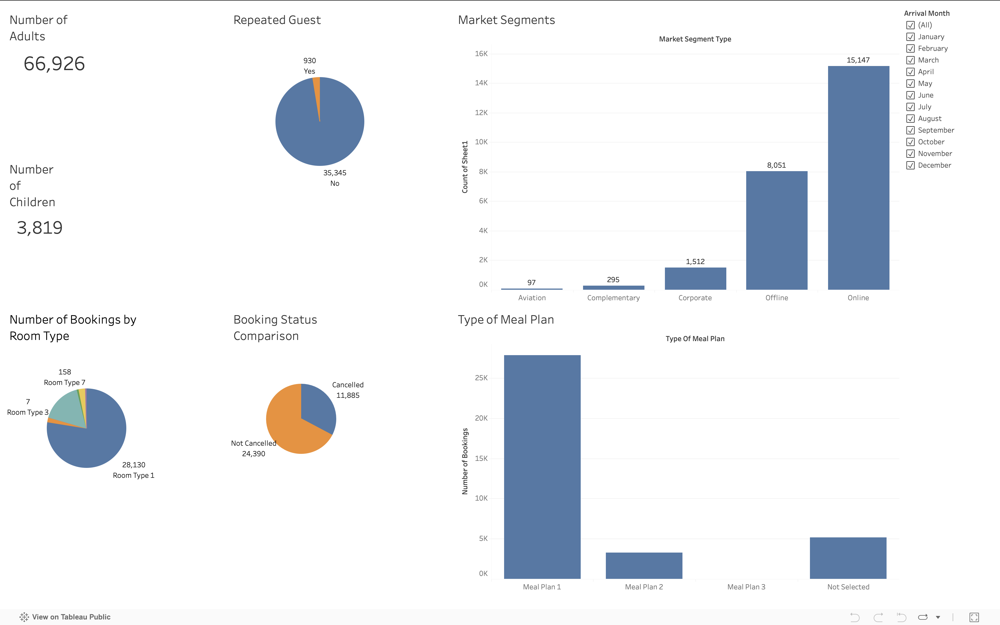

# 🏨 Welcome to My Hotel Booking Data Analysis Portfolio!

This project dives into hotel booking data to uncover valuable insights that can help improve hotel operations, enhance the guest experience, and reduce cancellations. Whether you're curious about booking trends or room preferences, this analysis brings the story behind the data to life!

---

## 📦 About the Dataset

The dataset was sourced from [Kaggle](https://www.kaggle.com/datasets/ahsan81/hotel-reservations-classification-dataset) and contains detailed records of hotel bookings. It includes guest information, stay duration, room types, prices, booking status, and more.

Kaggle Dataset Source: https://www.kaggle.com/datasets/ahsan81/hotel-reservations-classification-dataset

### 📋 Key Features in the Dataset:

- **Booking_ID** – Unique ID for each booking  
- **no_of_adults / no_of_children** – Number of guests  
- **no_of_weekend_nights / no_of_week_nights** – Length of stay  
- **type_of_meal_plan** – Meal options selected  
- **required_car_parking_space** – Parking request (Yes/No)  
- **room_type_reserved** – Room type reserved (encoded)  
- **lead_time** – Days between booking and arrival  
- **arrival_year / month / date** – Booking arrival details  
- **market_segment_type** – Customer segment (e.g. online, corporate)  
- **repeated_guest** – Is the customer a repeat guest?  
- **previous_cancellations / not_canceled** – Guest history  
- **avg_price_per_room** – Price per night (in euros)  
- **no_of_special_requests** – Number of special requests made  
- **booking_status** – Final status (Canceled or Not Canceled)

---

## 🔍 What I Did

### 🛠️ Steps in the Analysis Process:

1. **Data Collection**  
   - Downloaded from [Kaggle](https://www.kaggle.com/datasets/ahsan81/hotel-reservations-classification-dataset) as a CSV file.

2. **Data Cleaning & Wrangling**  
   - Checked for missing values, duplicates, and formatting issues.

3. **Exploratory Data Analysis (EDA)**  
   - Visualized key patterns and relationships using Python libraries.

4. **Business Questions Explored:**
   - Which room type is most booked by families with children?
   - What’s the most common group size?
   - Which months are the busiest for bookings?
   - What do repeat guests usually book?
   - Which rooms get canceled the most?
   - What rooms receive the most special requests?
   - Which factors are most related to booking cancellations?
  
**For a detailed analysis, process, and insight, you can view the notebook here : [Hotel Booking Analysis📄](https://github.com/ngrlearningjourney/hotel-reservation-analysis/blob/main/hotel_reservation_analysis.ipynb)**
  
5. **Developing Dashboard**
Explore the insights through my interactive Tableau Public dashboard. Click the image below to view it:  
  

---

# **Insights**

**Hotel Booking Insights Summary**

1. **Room Preferences for Families**

   * **Room Type 1** is the top choice for guests with children, making up **54.6%** of bookings.
   * **Room Type 6** follows at **29.1%**.

2. **Most Common Group Size**

   * The majority of hotel bookings are for **2 people**, with **15,573 reservations** made for this group size.

3. **Monthly Booking Trends**

   * **October** sees the highest booking volume (**3,423 bookings**), followed by **September** (**3,067**) and **December** (**2,603**).

4. **Room Preferences of Repeat Guests**

   * **Room Type 1** dominates among returning guests, accounting for **86.8%** of repeat bookings.
   * **Room Type 4** is the second most chosen at **7.3%**.

5. **Booking Status by Room Type**

   * **Room Type 1** has the highest **number of cancellations** (**9,072**) and also the highest **number of completed bookings** (**19,058**), indicating its overall popularity.

6. **Special Requests by Room Type**

   * **Room Type 1** receives the most special requests (**15,691**), while **Room Type 3** receives the least.
  
# **🧩 Booking Status and Correlation Analysis**

* Using the **Spearman correlation method**, the **number of special requests** shows the highest correlation with **booking status**, with a correlation coefficient of **0.256**.

* A **positive correlation (0.256)** suggests that as the number of special requests increases, the booking status (e.g., confirmed or canceled) tends to move in the same direction.

* This value indicates a **weak to moderate positive relationship**, meaning that while special requests may have an influence on booking status, other factors likely play a more significant role.

* Using **point-biserial correlation** to measure the relationship between a numerical and a categorical variable (booking status: canceled vs. not canceled), the analysis revealed that **special requests** again had the **strongest correlation** with booking status.

* The correlation coefficient is **0.253**, indicating a **positive but weak relationship** — bookings with more special requests are **slightly less likely to be canceled**.

# **Suggestions to Improve Hotel Performance**

1. **Leverage Room Type 1’s Popularity More Strategically**

   * Since Room Type 1 is highly preferred (by families and repeat guests) but also has the most cancellations, consider:

     * Offering **flexible cancellation policies** or **incentives to confirm bookings** (e.g., early check-in or minor upgrades).
     * **Improving the description and photos** to manage expectations and reduce cancellations.

2. **Enhance Services for Families**

   * Given the high percentage of families booking Room Type 1 and Room Type 6, offer **family-focused packages** (e.g., discounts for children's meals, family activity guides, or babysitting services).

3. **Target Repeat Guests**

   * With Room Type 1 being the top choice for repeat customers, consider offering **loyalty perks** for those booking this room type, such as exclusive rates or welcome gifts.

4. **Optimize for Peak Months**

   * Boost staffing and promotions during **October, September, and December**, which are peak booking months.
   * Consider running **early bird promotions** for these months to lock in revenue and reduce last-minute cancellations.

5. **Re-evaluate Room Type 3**

   * With the fewest special requests, Room Type 3 may be under-personalized. Evaluate if its amenities or listing can be improved to increase appeal.

---

## 🧰 Tools Used

- Python  
- Pandas & NumPy  
- Matplotlib & Seaborn  
- Jupyter Notebook  
- Scipy (for correlation analysis)

---

## 📁 Project Files

- `hotel_booking_analysis.ipynb` – All analysis steps and visualizations  
- `hotel_booking_data.csv` – The dataset (available from [Kaggle](https://www.kaggle.com/datasets/ahsan81/hotel-reservations-classification-dataset))  
- `README.md` – You're reading it!
